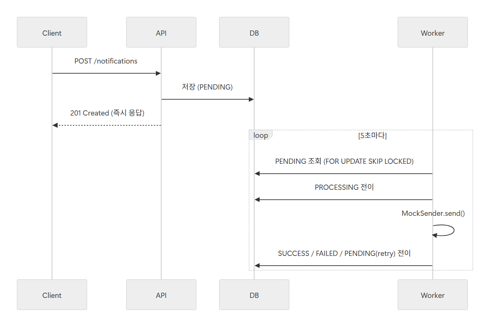
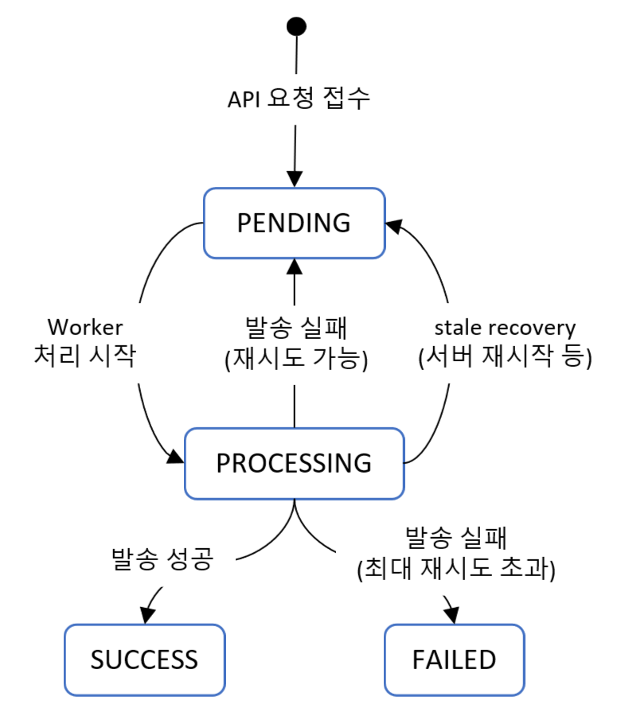
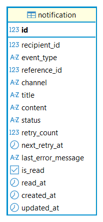

# 알림 발송 시스템

## 프로젝트 개요

수강 신청 완료, 결제 확정 등 이벤트 발생 시 사용자에게 이메일 또는 인앱 알림을 발송하는 시스템입니다.

알림 처리 실패가 비즈니스 트랜잭션에 영향을 주지 않도록, API 요청 스레드와 실제 발송을 분리했습니다.
메시지 브로커 없이 PostgreSQL을 durable queue로 활용해 상태 기반 비동기 처리를 구현했습니다.

핵심 요구사항 대응:

- 비동기 처리 구조 (API 요청 즉시 응답 → Worker 별도 처리)
- 재시도 정책 (Exponential Backoff, 최대 3회)
- 중복 발송 방지 (DB Unique Constraint 기반 Idempotency)
- 서버 재시작 후 미처리 알림 복구 (stale PROCESSING recovery)
- 다중 인스턴스 환경 대응 (`FOR UPDATE SKIP LOCKED`)

---

## 기술 스택

| 항목 | 선택 |
|---|---|
| Language | Java 21 |
| Framework | Spring Boot 3 |
| ORM | Spring Data JPA |
| DB | PostgreSQL 16 |
| Migration | Flyway |
| Infra | Docker Compose (PostgreSQL만) |
| Test | JUnit5 / Mockito |

---

## 실행 방법

### PostgreSQL 실행

```bash
docker-compose up -d postgres
```

### 애플리케이션 실행

```bash
./gradlew bootRun
```

> Flyway migration이 자동으로 실행되어 테이블이 생성됩니다.

### 동작 확인

```bash
# 알림 요청 등록
curl -X POST http://localhost:8080/notifications \
  -H "Content-Type: application/json" \
  -d '{
    "recipientId": 1,
    "eventType": "COURSE_REGISTERED",
    "referenceId": 100,
    "channel": "EMAIL",
    "title": "수강 신청 완료",
    "content": "수강 신청이 완료되었습니다."
  }'

# 5초 후 Worker가 처리 → PENDING → PROCESSING → SUCCESS
# 상태 조회
curl http://localhost:8080/notifications/{id}
```

---

## 요구사항 해석 및 가정

**"알림 처리 실패가 비즈니스 트랜잭션에 영향을 주어서는 안 된다"**

단순히 예외를 catch하고 무시하는 방식은 요구사항에서 명시적으로 금지했습니다.
API 요청 스레드에서 발송을 시도하지 않고, PENDING 상태로 저장만 한 뒤 응답을 반환합니다.
발송 실패는 Worker 레이어에서만 발생하며, API 응답 시간에 영향을 주지 않습니다.

**"동일한 이벤트에 대해 알림이 중복 발송되면 안 된다"**

`(recipient_id, event_type, reference_id, channel)` 조합에 DB Unique Constraint를 적용했습니다.
동시에 같은 요청이 여러 번 들어오더라도 DB 레벨에서 중복 생성을 막습니다.
중복 요청 시 409 Conflict를 반환해 클라이언트가 재시도 없이 처리할 수 있도록 했습니다.

**인증/인가**

과제 명세에 따라 `userId`를 PathVariable로 전달하는 방식으로 간략히 처리했습니다.

**실제 이메일 발송**

Mock Sender(로그 출력)로 대체했습니다. 실제 Provider 연동 시 `EmailNotificationSender` 구현체만 교체하면 됩니다.

---

## 설계 결정과 이유

### PostgreSQL durable queue 패턴

Kafka, Redis Queue, Temporal 등을 사용하지 않은 이유는 과제 제약사항(실제 메시지 브로커 설치 불필요) 때문이기도 하지만, 이 과제의 핵심인 상태 기반 비동기 처리 자체를 명확하게 보여주기에 DB 기반 구조가 더 적합하다고 판단했습니다.

PostgreSQL의 다음 기능을 활용했습니다.

- `FOR UPDATE SKIP LOCKED`: 다중 Worker 인스턴스가 동일 알림을 중복 처리하지 않도록 DB 레벨에서 제어
- Unique Constraint: 멱등성 보장
- 트랜잭션 기반 상태 전이: 상태 변경의 원자성 보장

`NotificationSender` 인터페이스와 Worker 분리 구조 덕분에 발송 채널 교체 시 API/Entity 변경 없이 구현체만 교체하면 됩니다.

### `FOR UPDATE SKIP LOCKED` 사용 이유

일반 `SELECT FOR UPDATE`는 다른 트랜잭션이 잠금 해제를 기다립니다. `SKIP LOCKED`는 이미 락이 잡힌 row를 건너뛰기 때문에 여러 Worker 인스턴스가 동시에 실행되어도 서로 다른 알림을 처리합니다. 락 경합 없이 병렬 처리가 가능합니다.

### 비동기 처리 구조



### 상태 전이

<p align="center">
  
</p>

읽음 여부는 별도 `is_read` 컬럼으로 관리해 `SUCCESS + UNREAD`, `SUCCESS + READ` 상태를 자연스럽게 표현합니다.

### 재시도 정책 (Exponential Backoff)

| 실패 횟수 | 다음 재시도 시각 |
|---|---|
| 1차 | 1분 후 |
| 2차 | 5분 후 |
| 3차 | 15분 후 |
| 초과 | FAILED |

`RetryPolicy`는 순수 static 유틸로 구현했습니다. Spring Bean이 아니기 때문에 단위 테스트가 간단하고, Processor가 `nextRetryAt` 값만 받아 Entity에 전달하면 됩니다. Entity의 `markFailed(message, nextRetryAt)`에서 `null` 여부에 따라 FAILED/PENDING 분기를 처리합니다.

### stale PROCESSING recovery

Worker 처리 중 서버가 종료되면 해당 알림이 PROCESSING 상태로 고착됩니다. 별도 `RecoveryWorker`가 1분마다 실행되어 `updated_at < now - 5분` 조건을 만족하는 PROCESSING 알림을 PENDING으로 복구합니다.

recovery 시 `retry_count`를 증가시키지 않는 이유: stale recovery는 비즈니스 실패가 아닌 인프라 장애(서버 크래시 등)로 인한 중단입니다. retry 횟수를 소모하면 실제 발송 기회가 줄어듭니다.

### Transaction boundary 분리

`NotificationPollingWorker`(루프)와 `NotificationProcessor`(단건 처리)를 별도 Bean으로 분리했습니다.

- self-invocation으로 인해 `@Transactional`이 적용되지 않는 문제를 방지
- 건별 트랜잭션 격리로 일부 실패가 전체 batch rollback으로 이어지지 않도록 처리

조회 트랜잭션 종료 후 엔티티가 detached 상태가 되므로,
Processor 트랜잭션에서 다시 조회해 managed 상태로 처리했습니다.


### 과도한 abstraction 지양

과제 수준에서 Service 인터페이스 분리, 도메인 이벤트, DDD 패턴 등을 적용하면 코드 복잡도만 높아집니다. 현재 구조에서 Worker와 API가 동일한 Repository를 직접 참조하는 것이 가장 단순하고 의도가 명확합니다. 유일하게 인터페이스를 사용한 곳은 `NotificationSender`인데, 이는 EMAIL/IN_APP 채널 분기가 필요하기 때문입니다.

---

## API 목록 및 예시

### POST /notifications — 알림 발송 요청

```json
// Request
{
  "recipientId": 1,
  "eventType": "COURSE_REGISTERED",
  "referenceId": 100,
  "channel": "EMAIL",
  "title": "수강 신청 완료",
  "content": "수강 신청이 완료되었습니다."
}

// Response 201
{
  "notificationId": 1,
  "status": "PENDING"
}

// 중복 요청 Response 409
{
  "status": 409,
  "message": "이미 동일한 알림이 존재합니다.",
  "timestamp": "2026-01-01T12:00:00"
}
```

`channel`은 `EMAIL` / `IN_APP`만 허용합니다.

### GET /notifications/{id} — 알림 상태 조회

```json
// Response 200
{
  "id": 1,
  "recipientId": 1,
  "eventType": "COURSE_REGISTERED",
  "channel": "EMAIL",
  "status": "SUCCESS",
  "retryCount": 0,
  "isRead": false,
  "createdAt": "2026-01-01T12:00:00",
  "updatedAt": "2026-01-01T12:00:05"
}
```

### GET /users/{userId}/notifications — 사용자 알림 목록

Query Parameter: `isRead=true|false` (생략 시 전체 조회)

```bash
GET /users/1/notifications
GET /users/1/notifications?isRead=false
```

---

## 데이터 모델 설명




`notification` 테이블 하나를 중심으로 설계했습니다.

알림 데이터 저장뿐 아니라,
retry / recovery를 위한 durable queue 역할도 함께 수행합니다.

주요 컬럼:

* `status`

    * PENDING / PROCESSING / SUCCESS / FAILED 상태 관리

* `retry_count`

    * 재시도 횟수 관리

* `next_retry_at`

    * retry 대상의 다음 재시도 시각
    * NULL이면 즉시 처리 가능

* `last_error_message`

    * 마지막 발송 실패 원인 저장

* `is_read`, `read_at`

    * 읽음 처리 상태 관리

### 제약조건 및 인덱스

```sql id="5l5v7u"
UNIQUE(recipient_id, event_type, reference_id, channel)
```

* 동일 이벤트 중복 발송 방지(idempotency)

```sql id="1jqw0n"
INDEX(status, next_retry_at)
WHERE status = 'PENDING'
```

* polling worker 조회 최적화

```sql id="2x5p2c"
INDEX(status, updated_at)
WHERE status = 'PROCESSING'
```

* stale recovery 조회 최적화

Partial Index(`WHERE status = ...`)를 사용해
SUCCESS / FAILED 상태로 누적되는 대부분의 레코드를 인덱스에서 제외했습니다.

이를 통해 polling / recovery 조회 성능이 유지되도록 구성했습니다.


---

## 테스트 실행 방법

### 단위 테스트 (DB 불필요)

```bash
./gradlew test --tests "*.NotificationTest"
./gradlew test --tests "*.NotificationProcessorTest"
./gradlew test --tests "*.NotificationRecoveryProcessorTest"
```

### Repository 통합 테스트 (PostgreSQL 필요)

```bash
docker-compose up -d postgres-test
./gradlew test --tests "*.NotificationRepositoryTest"
```

`FOR UPDATE SKIP LOCKED`는 PostgreSQL 전용 기능이라 H2 인메모리 DB로 대체하지 않았습니다.

### 전체 실행

```bash
docker-compose up -d postgres-test
./gradlew test
```

총 28개 테스트 통과를 확인했습니다.

---

## 미구현 / 제약사항

- 실제 Email Provider 연동 미구현 (Mock Sender로 대체)
- Dead Letter Queue 미구현
- 알림 템플릿 관리 기능 미구현
- 발송 스케줄링(특정 시각 예약) 미구현
- 인증/인가 미구현 (userId를 PathVariable로 전달)


### 개선 의견
- 운영 환경에서는 최종 실패 알림에 대한 DLQ와 발송 성공률 모니터링(metrics)이 필요합니다.
- 현재는 PostgreSQL polling 기반 구조를 사용했지만, 트래픽 규모가 커질 경우 메시지 브로커 기반 구조로 변경할 수 있다고 판단했습니다.
- 읽음 처리 동시성(여러 기기에서 동시 요청)은 is_read = true 갱신이 idempotent하므로
  현재 구조에서도 안전하지만, 기기별 읽음 상태 관리가 필요하다면 별도 테이블 분리가 필요합니다.

---
## AI 활용 범위

- ChatGPT / Claude를 활용하여 요구사항 해석, 설계 리뷰, 테스트 전략 검토, 보일러플레이트 코드 작성을 진행했습니다.
- ChatGPT를 통해 retry / recovery 정책, transaction boundary, 상태 전이 구조 등에 대한 설계 리뷰를 수행했습니다.
- Claude를 활용하여 일부 구현 코드 및 테스트 코드 초안을 작성했습니다.
- 생성된 코드와 설계 제안은 직접 검토·수정했으며, 로컬 실행과 테스트를 통해 동작을 확인했습니다.
